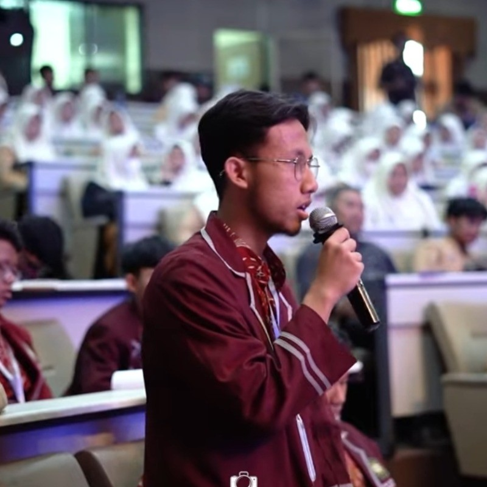

# 👋 Hello, I'm Ahmad Hafidzh
## ⚡ Electrical Engineer | 💡 Future Innovator

🛠️ **Current Skills**:  
  
  
  
  
  
  

---

- 🚀⚡ Currently an **electrical engineering student** at [**University of Brawijaya**](https://www.instagram.com/univ.brawijaya/).

- 🟢 ⚡Part of [**Society of Renewable Energy (SRE) Universitas Brawijaya**](https://www.instagram.com/sre.ub/) as an **Associate Competition**

